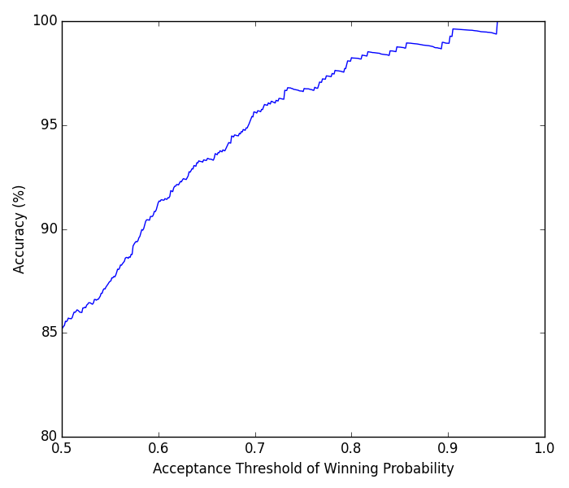
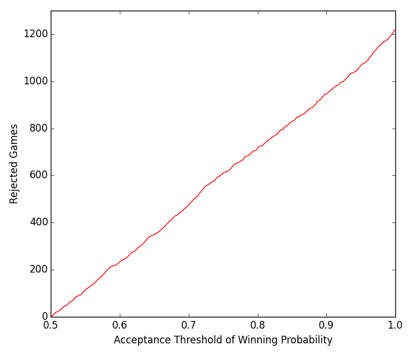

# TLGProb

Sports analytics is gaining much attention in the research community nowadays. Its success can, to a large extent, benefit many parties including the sports team owners, the general managers, the coaches and even the fans. 

This project deals with a prominent area of sports analytics, namely, winning probability calculation. We propose a decent model called TLGProb, which is designed generically for all kinds of team sport games. In order to maintain a probabilistic struture, we adopt Gaussian process regression (GPr) to infer distributions associated with a large number of attributes. 

Using TLGProb, we not only obtain a reasonably-determined winning probability for the teams competing on the next match, but also perform pre-game analysis for coaches to design feasible strategies. To demonstrate this feature of TLGProb, an online coaching plaform is developed.

For evaluation, we measure the effectiveness of our system in real matches. We selected one of the most popular team sport events around the world -- National Basketball Association (NBA) as the domain for experiments. Finally, using 1,230 matches from 2014/2015 season of NBA, our system correctly predicted the winning teams for approximately 85% of matches.

For any enquiries, please email me at maxingaussian@gmail.com

## Highlight: Two-Layer Gaussian Process Regression Model

## Highlight: Player's Ability Inference From Performance
<h3 align="center">
LeBron James FG rate
</h3>

<h3 align="center">
LeBron James 3P rate
</h3>

## Experimental Results

