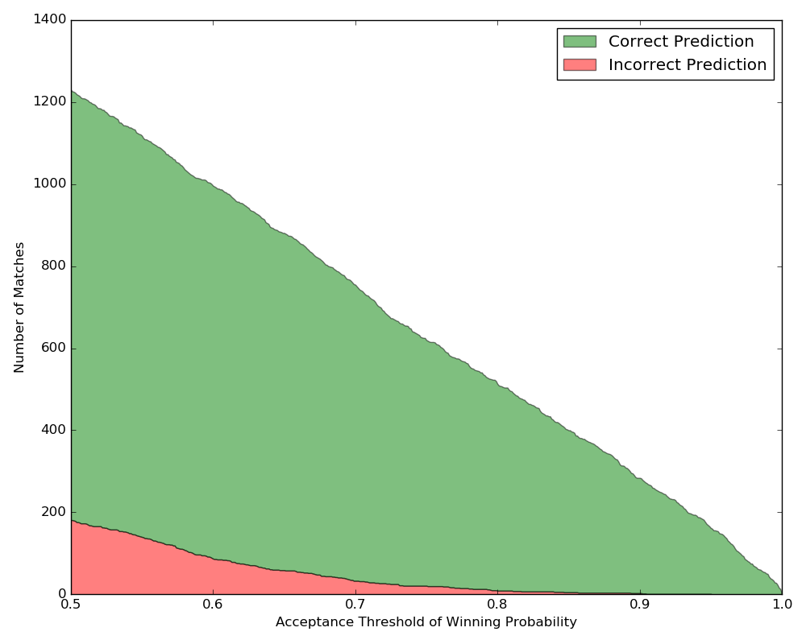
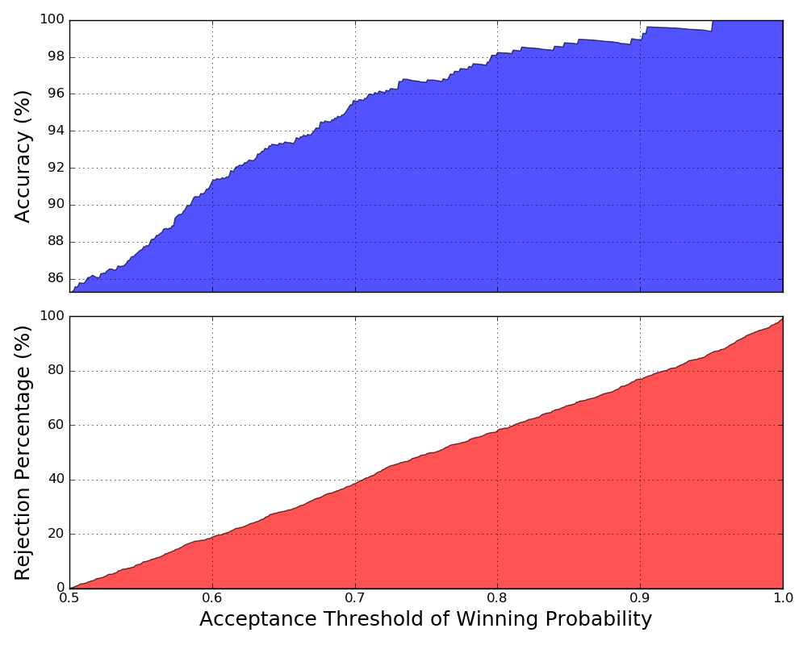

# TLGProb

Sports analytics is gaining much attention in the research community
nowadays. This project deals with a prominent problem in sports analytics, namely,
winning probability calculation. In particular, we focus on the two-team sports. A
novel model called TLGProb is proposed by stacking a non-linear regression model
– Gaussian process regression (GPR) to address complex association between match
outcomes and players’ performances. For evaluation, we selected a popular sports
event around the world – National Basketball Association (NBA) as the domain for
experiments. Finally, using TLGProb, we correctly predicted 85.28% of outcomes
among 1,230 matches in NBA 2014/2015 season.

For any enquiries, please email me at maxingaussian@gmail.com

## Highlight: Player's Ability Inferred From Player's Performance
<h3 align="center">
LeBron James
</h3>

## Highlight: Two-Layer Gaussian Process Regression Model

## Experimental Results

